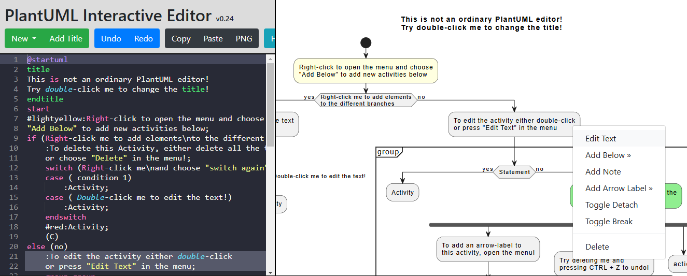

# Plantuml-Interactive-Editor

Welcome to PlantUML Interactive Editor! This application is designed to provide an intuitive and interactive environment for editing PlantUML code and generating diagrams in real-time. Whether you're creating a huge activity diagram or a single while loop, our tool streamlines the process, allowing you to focus on design rather than syntax.



With PlantUML Interactive Editor, you can:

- Edit PlantUML activity diagrams by directly interacting with the diagram
- Also change the diagram by editing the PlantUML code, just like other PlantUML editors, allowing you to choose code or interactive editing depending on what is easier in the moment
- Instantly preview diagrams as you type
- Easily share the created diagram

## Usage

- Right-click on elements to open context menu
- Double-click on elements to edit the text
- Submit edited text with the button or using CTRL + ENTER
- Left-click and drag in the diagram to pan
- Use mouse wheel or pinch on touch pad to zoom
- Delete the text of a title, note or group/partition to delete the element
- To share a diagram, just copy the URL in the address bar
- Hover over elements to see the corresponding line highlighted in the editor
- Clicking on a line with an activity in the editor highlights the corresponding activity in the diagram

## Detailed list of supported and unsupported features

[FEATURES.md](./FEATURES.md)

## Pre-requisites

- Python 3.10 or newer
- PlantUML, https://plantuml.com/starting
- The path to the PlantUML must be set in an .env file, see .env.example


## Installing and running the server

In the target python environment:

```
pip install .
python -m plantuml_gui
```

## Development

### Pre-requisites

- uv

### Setup

```
uv run pre-commit install -t pre-commit -t pre-push
```

### Running tests

#### Python

##### Without coverage

```
uv run pytest
```

##### With coverage

```
uv run python -m pytest --cov --cov-report=html
```

#### Javascript

1. Run `uv run python -m http.server` and open the server in a browser
2. In the browser, open tests/js/SpecRunner.html
