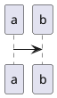

# PlantUML Interactive Editor (VS Code)

<table>
<tr>
<td>

Edit PlantUML diagrams by clicking them. Opens a diagram panel beside a `.puml`
file: right-click elements for context menus, double-click to edit text, and
every change is written back into the document as a single undoable edit.

Internal extension, distributed as a `.vsix`.

</td>
<td width="96">


</td>
</tr>
</table>

## Requirements

**Python 3.10 or newer**, which the extension uses to build a virtual environment of its
own and then runs the backend from as a local child process. How it is found:

| Platform | What is looked for |
| --- | --- |
| Linux, macOS | `python3` on your `PATH`, then `python3.13` down to `python3.10` by name. On Debian and Ubuntu the `python3-venv` package is needed too. |
| Windows | The `py` launcher, then `python` on your `PATH`. The python.org installer provides both. |

**Java and a `plantuml.jar`.** Rendering shells out to
`java -jar plantuml.jar`. A shared internal install is used when the machine has
one; otherwise set `plantumlInteractive.plantumlJar` to your own copy.

## Installing

```
code --install-extension plantuml-editor-<version>.vsix
```

That is the whole install. The `.vsix` carries the Python backend — the frontend and the
diagram-rewriting routes live in it — and the extension installs that wheel into a virtual
environment of its own the first time you open a diagram, under its VS Code global storage
directory. Expect a *Setting up the PlantUML backend…* notification for ten to twenty
seconds on that first open, while pip fetches Flask and a few other libraries; it needs
network access once.

Check the internal setup guide for where to get the `.vsix`, or build it yourself (see
"Development" below).

## Settings

| Setting | Environment variable | What it is |
| --- | --- | --- |
| `plantumlInteractive.pythonPath` | `PLANTUML_GUI_PYTHON` | Absolute path to an interpreter that has `plantuml-gui` installed. Optional; the extension installs one for itself. |
| `plantumlInteractive.plantumlJar` | `PLANTUML_JAR` | Absolute path to `plantuml.jar`. Optional if one of the fallbacks below applies. |

Both settings can be overridden by their environment variable. `PLANTUML_JAR`
is the same variable the web app reads, so a repository `.env` already
configures the extension. The VS Code setting takes precedence over the
environment variable; if you do set one and the path is wrong, you get an
error naming it — the fallbacks are not tried, so a typo cannot look like it
worked.

Both settings are `machine-overridable`: set them in machine settings, not in
a repository's `.vscode/settings.json`. In a remote window they appear under the
Settings editor's **Remote** tab.

Whitespace and one matching pair of surrounding quotes are stripped, so a path
pasted from a terminal works as-is. Nothing else is expanded — `~`,
`${workspaceFolder}` and `${env:...}` are taken literally.

Both paths reach the backend when it starts, so a changed setting takes effect
on the next start — reload the window if a diagram panel is already open.

## Usage

With a `.puml` file open in the active editor, run **PlantUML: Open Interactive
Diagram** from the Command Palette.

The panel then shows whichever PlantUML file you are in — the last one you
opened or switched to — so the command is needed once per window, and the tab
names the file on show. A `.txt` counts when it starts with a `@startuml` block;
a file that is not a diagram leaves the panel as it was.

### Diagrams in Markdown

A `.md` file works too, for diagrams written in a fenced code block:

````markdown
Some prose.


````

Put the caret in the block and the panel shows that diagram; editing it in the
panel rewrites those lines and leaves the prose around them alone. A file can
hold as many diagrams as you like — move the caret into another block and the
panel follows, and the tab names the block by its fence line, `notes.md:12`.
The caret in prose keeps the diagram you were last in on screen, so reading
around a diagram keeps it up. A fence indented inside a list item works, and
keeps its indentation.

The fence is read as a diagram when it opens with ` ```plantuml `, holds a
`@start…` line, and is closed. The PNG button exports the diagram the panel is
showing.

## Development

`F5` runs the Extension Development Host from `.vscode/launch.json`. That host
launches **without a workspace folder**, so workspace-scoped settings are not
read there; the `env` block in `launch.json` sets `PLANTUML_GUI_PYTHON` instead,
which is why that variable exists. It also outranks the managed environment, so
F5 does not exercise the install — to work on that, build `backend/` with
`scripts/build_release.sh` and unset the variable.

```
npm run lint     # eslint
npm test         # eslint, then the Mocha suites inside a real VS Code
```

`npm test` launches an actual editor, so it needs a display — under a headless
shell, run it with `xvfb-run`.

A release is one file, built from one commit:

```
scripts/build_release.sh              # from repo root; builds backend/ and the vsix
scripts/build_release.sh <directory>  # and publishes the vsix there
```

Architecture, the sidecar protocol and the webview contract are documented in
[`docs/extension.md`](../docs/extension.md).
